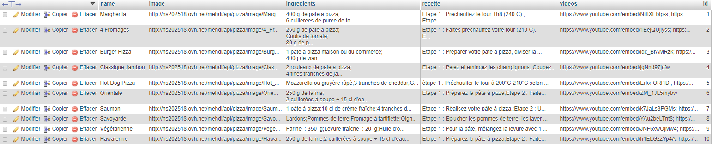
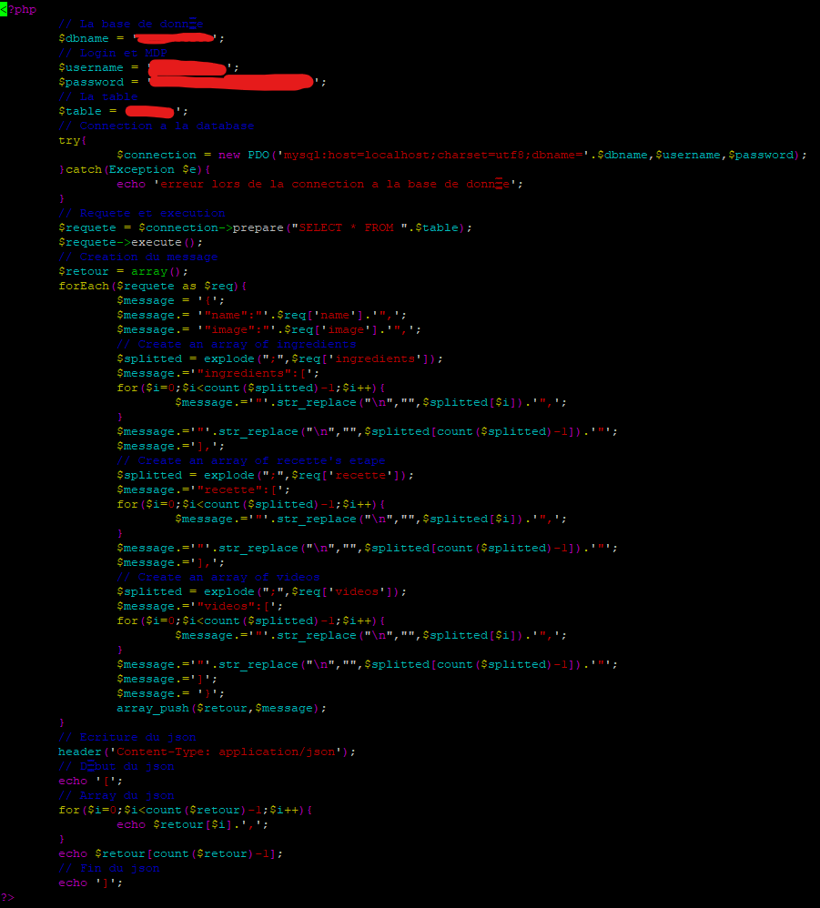
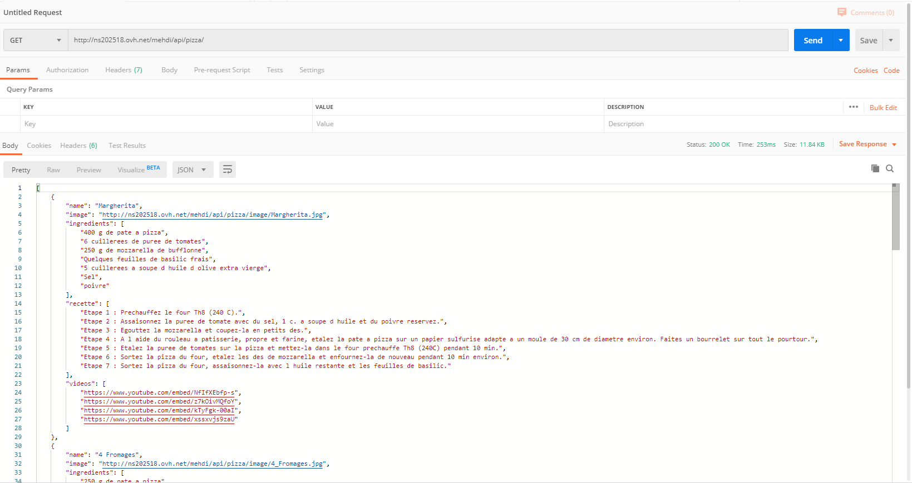

# pizza_AndroidStudio

    Explication :
    -------------

# But du projet
**Le projet doit contenir :**
 - Des Fragments
 - Appel WebService à une API Rest
 - Design
 - Architecture MVC
 - Git
 
**Contenu supplémentaire :**
 - Splash Screen
 - Navigation View
 - Recycler View, pour les images de pizza
 - Gestion de sa propre Api
 - Gestion de son propre serveur
 - Sauvegarde des données si on coupe internet
 - Suppression des données si on clique sur **déconnection**
 - Écran détaillé contenant :
   - RecyclerView de WebView, pour voir des vidéos sur comment réaliser ses pizzas
   - RecyclerView de TextView, pour voir les ingrédients
   - RecyclerView de TextView, pour voir la recette
 
# Composition du projet
Le projet est composé de plusieurs sous parties :
 - ***Splash Screen:*** Qui récupère l'api puis la stocke dans la ram du téléphone, si la data est déja existante dans la ram alors elle ne s'affiche plus.
 - ***Écran Principal :***  Pouvant supprimer toute la data stockée dans la ram, en cliquant sur **déconnection**
 

 - ***Écran Principal :*** Une Navigation View, contenant quatres types d'ordre :
    - Alphabétique : Permettant d'afficher les pizzas par ordre alphabétiques
    - Nombre d'ingrédients : Permettant d'afficher les pizzas par nombre d'ingrédients croissant
    - Nombre de vidéos : Permettant d'afficher les pizzas par nombre de vidéos croissant
    - Nombre d'étapes : Permettant d'afficher les pizzas par nombre d'étapes croissant
    
 
 - ***Écran de détail :*** Permettant de voir tout les détails de cette pizza :
    - Des vidéos de création
    - Les ingrédients nécessaires
    - La recette
    
 
# Serveur
L'api est stockée sur un serveur qui a une base de donnée sql :

Via mon code php ci-dessous, il prend la base de donnée et l'émet en json.

Et voici le résultat :

